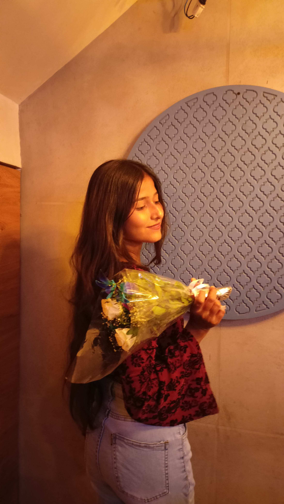

<!DOCTYPE html>
<html lang="en">
<head>
  <meta charset="UTF-8" />
  <meta name="viewport" content="width=device-width, initial-scale=1.0"/>
  <title>Happy Birthday Khushuu 💙</title>
  <link href="https://fonts.googleapis.com/css2?family=Pacifico&family=Nunito:wght@400;700&display=swap" rel="stylesheet">
  
</head>
<body>

  
🔊

  

    
💙

    <h2>For Khushuu 💙</h2>
    <h4 style="color:#fff;">Tap the heart to reveal your surprise!</h4>

    

      

      

        00 Days
        00 Hours
        00 Minutes
        00 Seconds
      

      

        "Good things take time, and your birthday is one of them.  Just waiting for the 28th to celebrate YOU!"
      

      

        🔊 Tap the speaker icon on the video to hear it!
      

      <video autoplay muted loop controls>
        <source src="HappyEdit.mp4" type="video/mp4">
        Your browser does not support the video tag.
      </video>

      

        Made with 💖 by your best friend Rishu
      

    

  

  <!-- Background Music -->
  <audio id="bg-music" autoplay loop>
    <source src="https://dl.dropboxusercontent.com/scl/fi/jgfsj66vsywky05j72ehe/kabhi-kabhi-aditi.mp3?rlkey=xdxj6o0q06z4w3sda3xlwo1ns&raw=1" type="audio/mpeg">
  </audio>

  <!-- Emoji Rain -->
  

  
</body>
</html>
